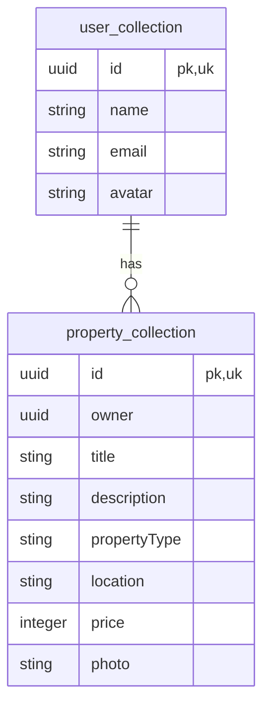

# Real Estate Admin Server Side Document

## ER Diagram

## API

1. **User API**

    - **List Users**

        `Method` : `GET`

        `Endpoint` : /api/v1/users

        `Response Schema` :

        | Key         | Type          | Detail                             |
        | ----------- | ------------- | ---------------------------------- |
        | status_code | integer       | api response status code           |
        | status      | enum          | response status                    |
        | data        | array[object] | response data                      |
        | detail      | string        | response detail when error happens |

        - `data`

        | Key        | Type          | Detail                        |
        | ---------- | ------------- | ----------------------------- |
        | name       | string        | user name                     |
        | email      | string        | user email                    |
        | avatar     | string        | user avatar                   |
        | properties | array[string] | all properties that user owns |

    - **Create User**

        `Method` : `POST`

        `Endpoint` : /api/v1/users

        `Request Schema` :

        | Key    | Type   | Detail      | Mandatory |
        | ------ | ------ | ----------- | :-------: |
        | name   | string | user name   |     Y     |
        | email  | string | user email  |     Y     |
        | avatar | string | user avatar |     Y     |

        `Response Schema` :

        | Key         | Type    | Detail                             |
        | ----------- | ------- | ---------------------------------- |
        | status_code | integer | api response status code           |
        | status      | enum    | response status                    |
        | detail      | string  | response detail when error happens |

    - **Get User by ID**

        `Method` : `GET`

        `Endpoint` : /api/v1/users/{id}

        `Parameter` :

        - `id` `(uuid)` : user id in uuid format

        `Response Schema` :

        | Key         | Type    | Detail                             |
        | ----------- | ------- | ---------------------------------- |
        | status_code | integer | api response status code           |
        | status      | enum    | response status                    |
        | data        | object  | response data                      |
        | detail      | string  | response detail when error happens |

        - `data`

        | Key        | Type          | Detail                        |
        | ---------- | ------------- | ----------------------------- |
        | name       | string        | user name                     |
        | email      | string        | user email                    |
        | avatar     | string        | user avatar                   |
        | properties | array[string] | all properties that user owns |

2. **Property API**

    - **List Properties**

        `Method` : `GET`

        `Endpoint` : /api/v1/properties

        `Parameters` :

        | Key     | Type    | Detail                                  | Mandatory |
        | ------- | ------- | --------------------------------------- | --------- |
        | sec     | integer | data section `default = 1`              | N         |
        | limit   | integer | limit data in response `default = 10`   | N         |
        | keyword | string  | property title keyword `default = None` | N         |
        | type    | string  | property type `default = None`          | N         |

        `Response Schema` :

        | Key         | Type    | Detail                             |
        | ----------- | ------- | ---------------------------------- |
        | status_code | integer | api response status code           |
        | status      | enum    | response status                    |
        | data        | object  | response data                      |
        | detail      | string  | response detail when error happens |

        - `data`

        | Key        | Type          | Detail                        |
        | ---------- | ------------- | ----------------------------- |
        | name       | string        | user name                     |
        | email      | string        | user email                    |
        | avatar     | string        | user avatar                   |
        | properties | array[string] | all properties that user owns |

    - **Get Property Detail**

        `Method` : `GET`

        `Endpoint` : /api/v1/properties/{id}

        `Parameter` :

        - `id` `(uuid)` : property id in uuid format

    - **Create Property**

        `Method` : `POST`

        `Endpoint` : /api/v1/properties

    - **Delete Property**

        `Method` : `DELETE`

        `Endpoint` : /api/v1/properties/{id}

        `Parameter` :

        - `id` `(uuid)` : property id in uuid format

    - **Update Property**

        `Method` : `PATCH`

        `Endpoint` : /api/v1/properties/{id}

        `Parameter` :

        - `id` `(uuid)` : property id in uuid format
