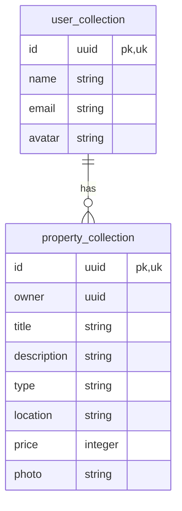

# Database Schema

```mermaid
erDiagram

    user_collection {
        id uuid  pk, uk
        name string
        email string
        avatar string
    }


    property_collection {
        id uuid pk, uk
        owner uuid
        title string
        description string
        type string
        location string
        price integer
        photo string
    }

    user_collection ||--o{ property_collection : has
```
